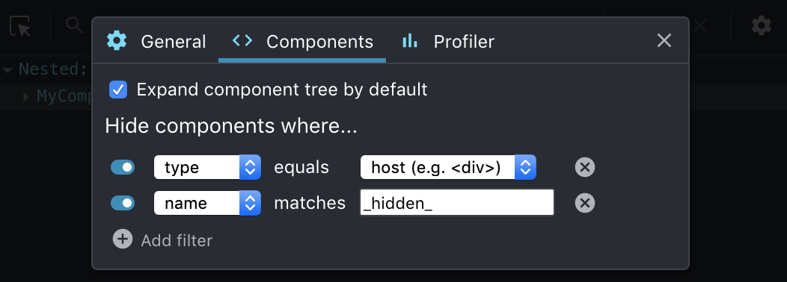
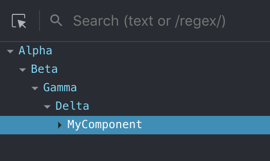
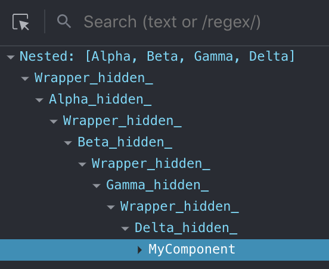
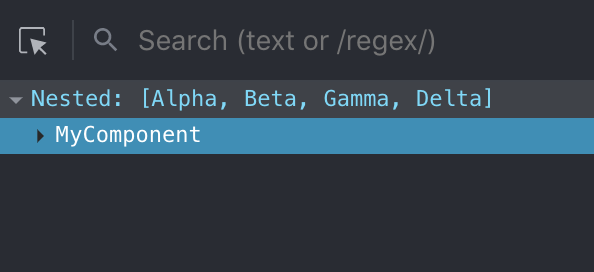

# react-nested
This is an experimental plugin. It helps you hide nested parent components while using React DevTools. Exports `ReactNested` component which has `parents` prop. Components you specify in this prop will be used as wrappers. What this plugin does under the hood is adding `_hidden_` suffix to display names of your components by cloning them.

## Usage

Without using **react-nested**:

```js
import ReactNested from 'react-nested'

ReactDOM.render(
  <Alpha prop1={1}>
    <Beta>
      <Gamma prop1={1} prop2={'test'}>
        <Delta>
          <MyComponent />
        </Delta>
      </Gamma>
    </Beta>
  </Alpha>,
  document.getElementById('root')
);
```

With **react-nested**:

```js
import ReactNested from 'react-nested'

ReactDOM.render(
  <ReactNested
    parents={[
      (props) => <Alpha prop1={1} children={props.children} />,
      (props) => <Beta children={props.children} />,
      (props) => <Gamma prop1={1} prop2={'test'} children={props.children} />,
      (props) => <Delta children={props.children} />,
    ]}
  >
    <MyComponent />
  </ReactNested>,
  document.getElementById('root')
);
```
There is also one more step: In your React DevTools, by clicking 'Add Filter' in settings, add the following filter:
**Hide components when 'name' matches '\_hidden\_'**


## Comparison
|Without this plugin|With this plugin|With this plugin,<br/> Filter is set on Settings|
|-|-|-|
|  |  |  |
